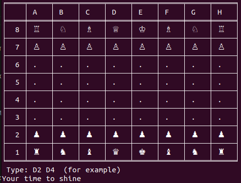

# Chess Bot using Alpha-Beta Algorithm

## Introduction
This is a chess bot I have created that utilizes the Alpha-Beta algorithm. It is capable of playing chess against a human player.

## Prerequisites
Before running the program, ensure that you have the following:
- Python installed on your machine
- Cloned the repository to your local environment

## How to Use
To use the chess bot, follow these steps:
1. Open your terminal or command prompt.
2. Navigate to the cloned repository directory.
3. If you don't have tabulate : `pip install tabulate` 
4. Run the following command: `python main.py` or `pypy3 main.py`
5. The game will start, and you will be prompted for your actions as the human player  (You can only play with whites for the moment, Bot plays with blacks).

## Alpha-Beta Algorithm
The chess bot utilizes the Alpha-Beta algorithm, which is a search algorithm commonly used in game-playing scenarios. It evaluates different possible moves and determines the best move based on a scoring system. 

## License
This chess bot is released under the MIT License. You are free to modify and distribute the code as per the terms of the license.

